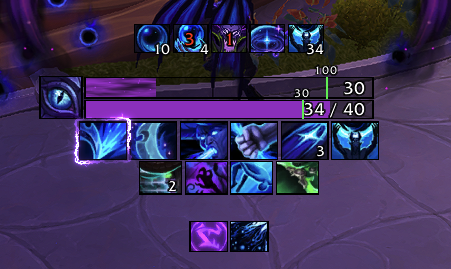
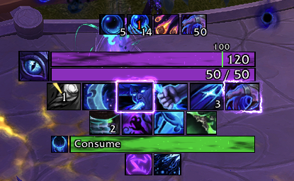
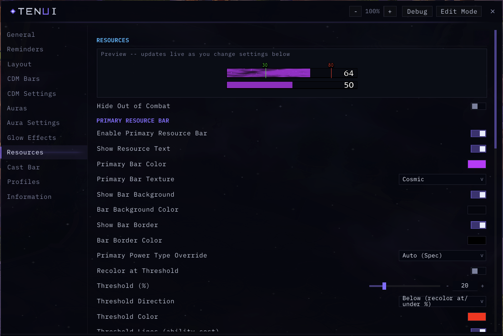
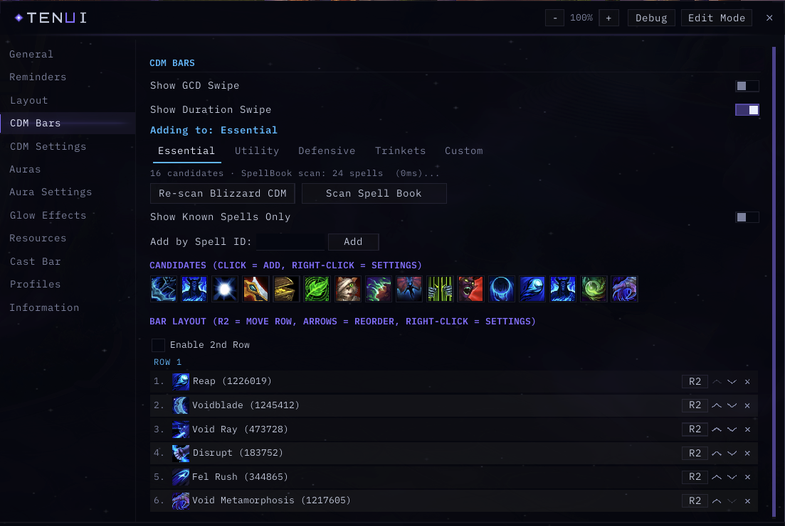

# TenUI

A clean, combat-focused HUD for World of Warcraft: cooldowns, auras, resources, cast bar and trinkets in one configurable package.

     

## Screenshots

| HUD in combat | Cast bar and cooldown rows |
|:---:|:---:|
|  |  |

Options window, Resources page:

Options window, CDM Bars page with the per-spell list:

<!-- GIF: rotation in combat showing cooldown swipes, glow procs and resource updates -->

## Features

### Cooldown Bars
- Rows of square cooldown icons driven by the built-in Cooldown Manager, organized into Essential, Utility, Defensive, Trinkets, Consumables and Custom groups.
- Per-ability settings: visibility, ordering and display behavior for each tracked spell.
- Resource and usability color coding that mirrors the Cooldown Manager: ready, out of range, not enough resource and unusable are shown with distinct tints, and icons dim while on cooldown.
- Consumables tracker for healthstones, potions and more, with an icon grid to choose what to track and the option to add items by ID.
- Built-in scanner keeps tracked abilities in sync with your current spec and talents.

### Aura Tracking
- Track buffs and debuffs as icon rows or timer bars, with stack counts and cooldown swipes.
- Low-time coloring for timers so expiring effects stand out.
- Tracked icons and bars follow the built-in Cooldown Manager closely and keep displaying through combat.

### Cast Bar
- Replacement player cast bar with support for casts, channels and empowered spells.
- Configurable size, textures, fonts and position.

### Resources
- Primary and secondary resource bars for every class and spec, including discrete pips for combo points, holy power, chi and similar resources.
- Combat-aware visibility options.

### Glow Effects
- Animated border glows for procs and ability highlights, with ten distinct flipbook styles.
- Separate glows for procs, ready abilities, maximum charges, active auras and pandemic windows, each with its own style, color and on/off toggle.
- Per-purpose defaults with a live preview in the options window.

### Skyriding
- A skyriding HUD with a speed bar and a configurable Thrill of the Skies threshold marker.
- Charge pips for Skyward Ascent and Second Wind, plus the Whirling Surge cooldown.

### Quality of Life
- Combat enter/leave text alerts.
- Stealth and prowl indicator.
- Class buff and talent build reminders.
- Optional spell and item IDs in tooltips.

### Layout and Anchoring
- Every element sits on a named anchor: unlock, drag, snap and fine-tune with X/Y, scale and alpha controls.
- Smooth live snapping in edit mode, hold Shift to lock dragging to a single axis, and an adjustable snap distance.
- Per-element visibility by state (always, never, in combat, out of combat, in raid, in party or solo), with options to show only inside instances and to hide while in housing or while mounted.
- Anchor reset commands for individual elements or the whole layout.

### Profiles
- Multiple profiles with rename and copy support, and an ordered profile list.
- Automatic profile swapping per specialization.
- Export any profile as a text string and import it on another character or share it with friends.

### Interface
- A unified, styled options window covering every module.
- SharedMedia support for fonts and bar textures, plus a set of bundled bar fill textures.

## Installation

### CurseForge (recommended)
1. Install the CurseForge app or visit the TenUI project page.
2. Search for "TenUI" and click Install.
3. Restart the game or reload your UI.

### Manual
1. Download the latest release from [GitHub Releases](https://github.com/Tendoriel/TenUI/releases).
2. Extract the archive so that the `TenUI` folder is inside `World of Warcraft/_retail_/Interface/AddOns/`.
3. Restart the game or run `/reload`.

## Getting Started

1. Type `/tenui` to open the version summary and command list, or use the addon compartment button on the minimap.
2. Run `/tenui unlock` to unlock all anchors, drag elements where you want them, then `/tenui lock`.
3. Open the options window to configure modules, abilities and auras.

Useful commands:

| Command | Effect |
|---|---|
| `/tenui` | Show version and command list |
| `/tenui unlock` / `/tenui lock` | Unlock or lock anchors for dragging |
| `/tenui reset anchors` | Reset all element positions to defaults |
| `/tenui reset anchor <name>` | Reset a single element |
| `/tenui reset` | Prompt to wipe all saved settings |

## Configuration

The options window is organized by module:

- **Layout** — select any anchor and adjust position, scale and alpha with sliders and snap controls.
- **CDM Bars** — manage Essential, Utility, Defensive, Trinkets, Consumables and Custom cooldown groups, with per-ability sub-pages.
- **Auras** — configure tracked icons and tracked bars, including which buffs and debuffs to follow.
- **Glow Effects** — choose glow styles per purpose and preview them live.
- **Resources** — resource bar appearance and visibility.
- **Cast Bar** — cast bar appearance and behavior.
- **Dragon Riding** — skyriding speed bar, charge pips and Whirling Surge cooldown.
- **Profiles** — manage, rename, copy, export and import profiles, and set up per-spec swapping.
- **Information** — version, module status and a quick command reference.

## FAQ

**Some aura timers behave differently in combat. Why?**
Since patch 12.0, the game hides certain combat data (exact health, aura durations and similar values) from addons while you are fighting. TenUI uses the supported display mechanisms so swipes, timers and colors keep updating, but a small number of details can only refresh fully once combat ends. This is a game-wide limitation that affects all addons.

**Can I move elements while in combat?**
No. Unlocking and dragging anchors is blocked during combat by the game. Leave combat, run `/tenui unlock`, and arrange your layout.

**Does TenUI replace the built-in Cooldown Manager?**
TenUI builds on top of it. The Cooldown Manager remains the source of truth for which abilities are tracked, and TenUI presents them with its own bars, icons and styling.

**How do I share my setup with a friend?**
Open Profiles in the options window, click Export Active Profile, and copy the text. Your friend pastes it into the Import box on their end. Existing profiles are never overwritten by an import.

**My layout broke after an update. How do I recover?**
Run `/tenui reset anchors` to restore default positions without touching the rest of your settings. As a last resort, `/tenui reset` wipes all saved settings after a confirmation prompt.

## Feedback and Issues

Bug reports and feature requests are welcome on the [GitHub issue tracker](https://github.com/Tendoriel/TenUI/issues). When reporting a bug, please include your game version, the TenUI version (shown by `/tenui`), and steps to reproduce.

## License

TenUI is released under the [MIT License](https://github.com/Tendoriel/TenUI/blob/main/LICENSE).